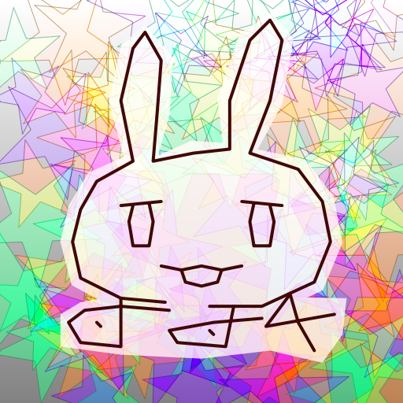

# Nanachi - pure Rust 2D graphics library

**NOTE: Nanachi is still buggy and the API will changed!**



Generated by `cargo run --release --example nanachi`

## Features
- path filling and stroking
- linear gradients, radial gradients and tiled images coloring
- 24 color-composition modes
- anti-aliasing (or not use)
- affine transformation
- κ-curve implementation

## Usage
Basic usage example is following:

``` rust
use image::RgbaImage;
use nanachi::{
    compositor,
    context::{Context, FillStyle},
    fill_color, fill_rule,
    path_builder::PathBuilder,
    pixel::Rgba,
};

let (width, height) = (512, 512);

// Make a Context
let mut context = Context::from_pixel(width, height, Rgba([1.0, 1.0, 1.0, 1.0])).high_quality();

// Make a Path
let mut builder = PathBuilder::new();
builder.move_to(100.0, 100.0);
builder.line_to(200.0, 100.0);
builder.line_to(200.0, 200.0);
builder.line_to(100.0, 200.0);
builder.close();
let path = builder.end();

// Make a FillStyle for filling
let fill_style = FillStyle {
    color: fill_color::Solid::new(Rgba([1.0, 0.0, 0.0, 0.7])),
    fill_rule: fill_rule::NonZero,
    compositor: compositor::SrcOver,
    pixel: Default::default(),
};

// Fill the path
context.fill(&path, &fill_style);

// Make a FillStyle for stroking
let fill_style = FillStyle {
    color: fill_color::Solid::new(Rgba([0.0, 0.0, 1.0, 1.0])),
    fill_rule: fill_rule::NonZero,
    compositor: compositor::SrcOver,
    pixel: Default::default(),
};

// Stroke the path
context.stroke(&path, &fill_style, 8.0);

// Save the image
let img: RgbaImage = (&context.image).into();
img.save("./basic.png").unwrap();
```

## Author

* carrotflakes (carrotflakes@gmail.com)

## Copyright

Copyright (c) 2020 carrotflakes (carrotflakes@gmail.com)

## License

Licensed under the MIT License.
